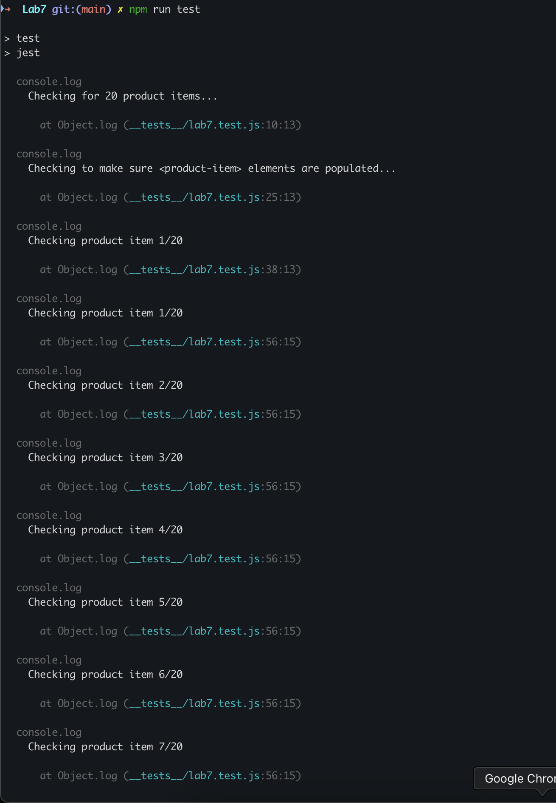
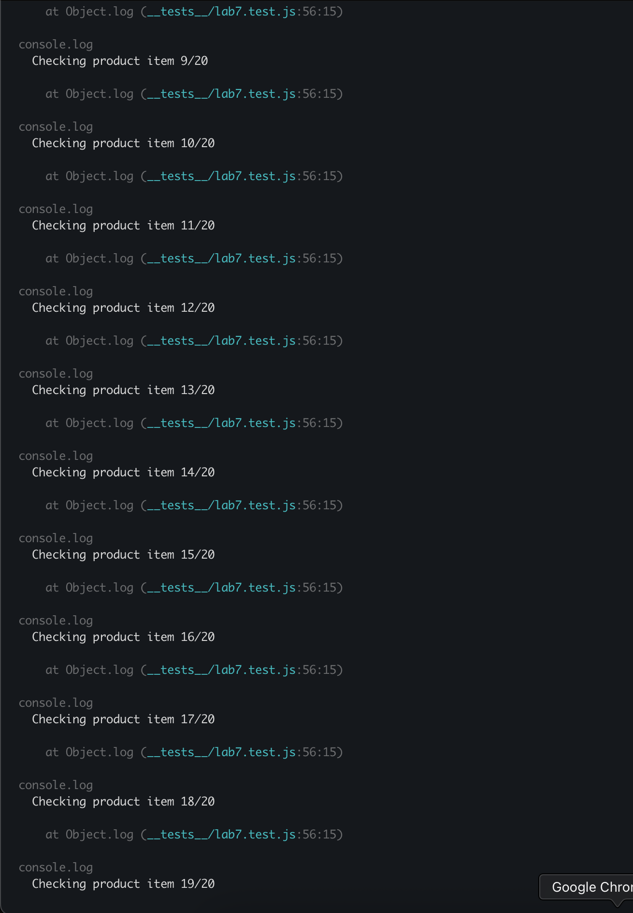
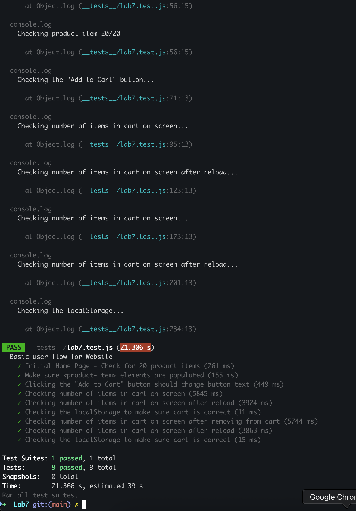

# CSE 110 Lab 7
**Xiaogeng Xu**
## Check Your Understanding
1. Answer: **1. Within a Github action that runs whenever code is pushed**

    Explanation: Running tests automatically every time someone pushes code helps us catch problems early. It makes sure the app still works after changes. This way, we don’t forget to run tests, and we can fix issues before they grow bigger. It also helps everyone on the team know that the code is safe to use.

2. No

3. Navigation mode tests the website from the moment it loads to see how fast and smooth it is, which helps check loading speed and first-time visitor experience. Snapshot mode looks at the page as it currently is without reloading it, and is mainly used to find issues like missing labels or accessibility problems, but it doesn’t measure how fast the page loads.

4.
    1. Add a `<meta name="viewport">` to help the website look better.
    2. Add `[lang]` attribute to `<html>` element to improves accessibility.
    3. Add meta description to Document to improve SEO.

## Screenshots: Test Result of `lab7.test.js`

